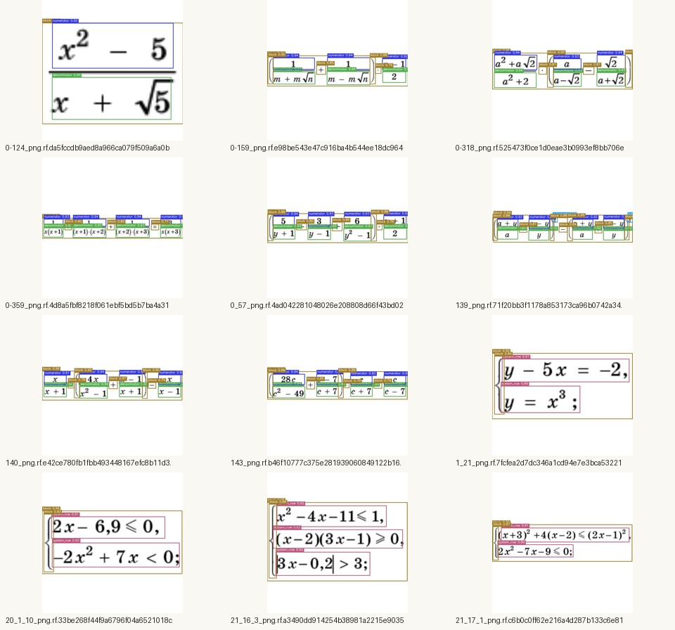
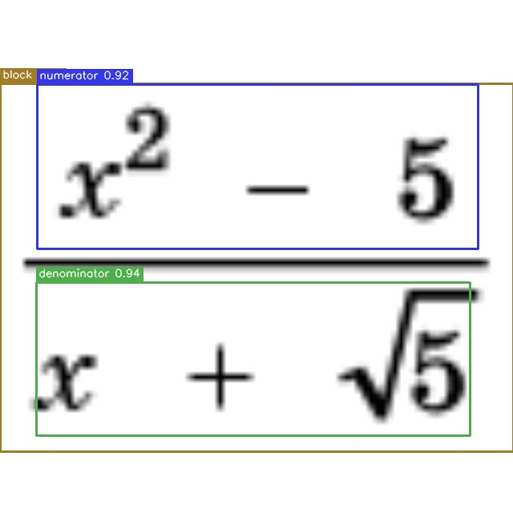
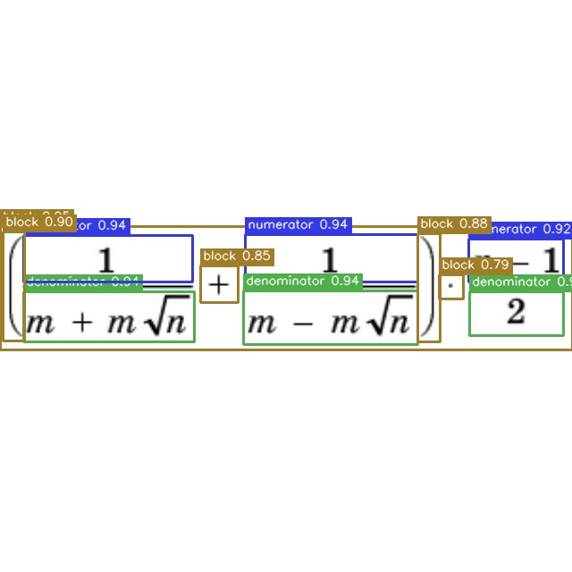
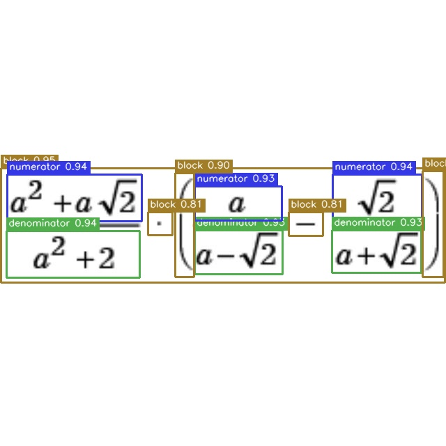
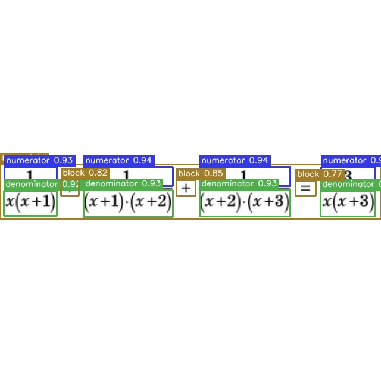
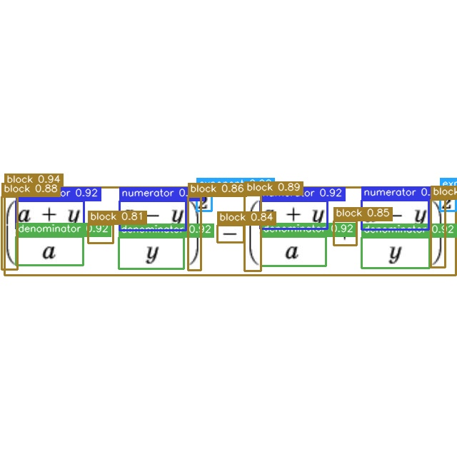
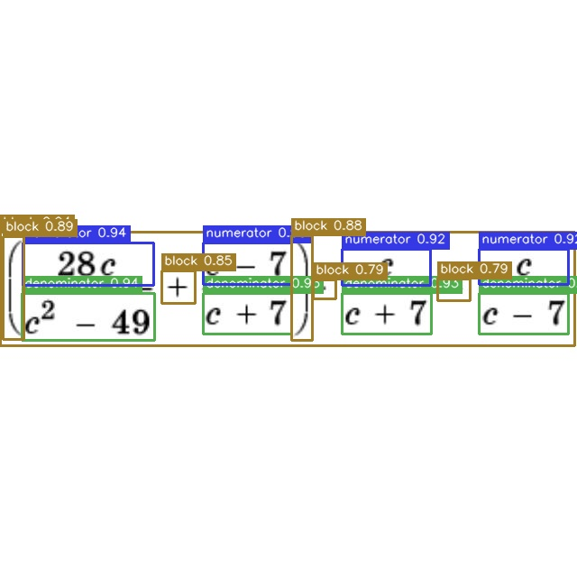

# exp001_baseline

## Summary

- Date: 2026-03-25
- Model: YOLOX-Nano
- Exp file: `configs/train/yolox_nano.py`
- GPU: NVIDIA GeForce RTX 4060, 8 GB VRAM
- Environment: `.venvs/formulalens-train-cu124`
- Pretrained checkpoint: `weights/pretrained/yolox_nano.pth`
- Fine-tuned artifacts: `weights/finetuned/yolox_nano_exp001_train_only/`

## Run Command

```bash
source .venvs/formulalens-train-cu124/bin/activate
BATCH_SIZE=8 bash scripts/train.sh --fp16
```

Training started at `2026-03-25 23:28:18` and finished at `2026-03-25 23:38:53`.

## Dataset

- Prepared dataset root: `datasets/prepared/formulas_coco_v1`
- Images: `202`
- Annotations: `1735`
- Classes: `block`, `denominator`, `exponent`, `numerator`, `system_row`, `text`

## Important Evaluation Note

This Roboflow export currently contains only `train`.
Because `instances_val2017.json` is absent, the exp falls back to evaluating on `train2017`.
So the run is valid as a smoke-tested GPU baseline, but the reported AP is not a held-out validation metric.

## Main Result

- `best_ckpt.pth`: `weights/finetuned/yolox_nano_exp001_train_only/best_ckpt.pth`
- Best AP50:95: `0.775686` (`77.57%`)
- Best checkpoint metadata: `start_epoch=100`
- Final epoch AP50:95: `0.765`
- Final epoch AP50: `0.996`
- Final epoch AP75: `0.958`

## Final Epoch Per-Class AP

| Class | AP |
| --- | ---: |
| block | 74.380 |
| denominator | 84.741 |
| exponent | 68.249 |
| numerator | 84.784 |
| system_row | 79.994 |
| text | 66.667 |

## Produced Artifacts

- `weights/finetuned/yolox_nano_exp001_train_only/best_ckpt.pth`
- `weights/finetuned/yolox_nano_exp001_train_only/last_epoch_ckpt.pth`
- `weights/finetuned/yolox_nano_exp001_train_only/latest_ckpt.pth`
- `weights/finetuned/yolox_nano_exp001_train_only/train_log.txt`
- `weights/finetuned/yolox_nano_exp001_train_only/tensorboard/`

## Readiness Status

Ready now:

- YOLOX repo is installed and wired into the project.
- CUDA training environment is installed and works on RTX 4060.
- Pretrained weights are present.
- Dataset normalization works.
- GPU fine-tuning runs end-to-end and produces checkpoints.

Still needed for a trustworthy benchmark:

- Export a Roboflow split with `valid`, or add a real `val` set under `datasets/roboflow_exports/formulas_coco_v1/valid`.
- Re-run `scripts/prepare_dataset.py` so it creates `annotations/instances_val2017.json`.
- Re-run training to get held-out validation metrics.

## Qualitative Sweep

Added on `2026-03-26` after `src/formulalens/inference.py` was implemented.
These examples were generated with the current best inference checkpoint `weights/finetuned/yolox_nano/best_ckpt.pth` against `24` real formulas from `datasets/prepared/formulas_coco_v1/val2017`.

- Images processed: `24`
- Total detections: `199`
- Min detections per image: `3`
- Max detections per image: `18`
- Average detections per image: `8.29`
- Assets root: `experiments/assets/exp001_baseline/`
- Summary JSON: `experiments/assets/exp001_baseline/qualitative_summary.json`

Representative contact sheet:



Selected examples:

- `0-124_png.rf.da5fccdb9aed8a966ca079f509a6a0bb.jpg` -> `3` detections (`block`, `denominator`, `numerator`)  
  
- `0-159_png.rf.e98be543e47c916ba4b544ee18dc9643.jpg` -> `11` detections  
  
- `0-318_png.rf.525473f0ce1d0eae3b0993ef8bb706e7.jpg` -> `11` detections  
  
- `0-359_png.rf.4d8a5fbf8218f061ebf5bd5b7ba4a317.jpg` -> `12` detections  
  
- `139_png.rf.71f20bb3f1178a853173ca96b0742a34.jpg` -> `18` detections  
  
- `143_png.rf.b46f10777c375e281939060849122b16.jpg` -> `14` detections  
  
